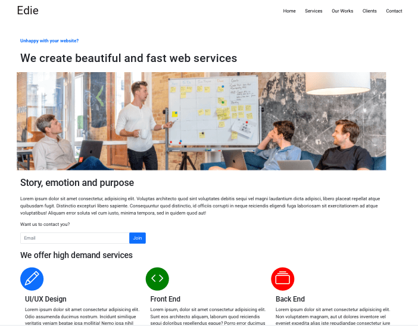

<h1 align="center">Edie Homepage</h1>

   Solution for a challenge from  <a href="http://devchallenges.io" target="_blank">Devchallenges.io</a>.

  <h3>
    <a href="https://jdegand.github.io/edie-homepage">
      Live Link
    </a>
     | 
    <a href="https://devchallenges.io/challenges/xobQBuf8zWWmiYMIAZe0">
      Challenge
    </a>
  </h3>

## Table of Contents

- [Overview](#overview)
  - [Built With](#built-with)
- [Features](#features)
- [Useful Resources](#useful-resources)

## Overview

- Bootstrap icons - use font-size and color to manipulate
- Bootstrap overflow options are limited. Nothing to target overflow-x or overflow-y ?  

- Grid-template-areas > Bootstrap nested grids
- Bootstrap grids expect content inside every column - leaving one column or row free is difficult and documentation / examples hard to find
- Grid-template-areas you can just place a "." and you have free space - bootstrap equivalent to this is ... using br tags or clearfix

- Rounded class is really weak even at maximum.  Feel same can be said about quite a few properties.

- Chose to make box shadow for only the border-bottom - cause of container class - probably had to rework whole section to add gaps etc

- Gray on Gray input boxes were not implemented
- I shifted the 3 picture grid on smaller screens to underneath the paragraph

- This project refreshed my knowledge of Bootstrap (v5 vs v4).  

### Built With

- [Bootstrap](https://getbootstrap.com/)

## Features

This application/site was created as a submission to a [DevChallenges](https://devchallenges.io/challenges) challenge. The [challenge](https://devchallenges.io/challenges/xobQBuf8zWWmiYMIAZe0) was to build an application to complete the given user stories.

## Requirements 

- [x] I can see a page following the given design
- [x] I can see a page on mobile following the given design
- [x] I can go to certain locations by selecting links in navigation or footer
- [x] Surprise me with mobile navigation.

## Useful Resources

- [Steps to replicate a design with only HTML and CSS](https://devchallenges-blogs.web.app/how-to-replicate-design/)
- [Bootstrap Creative](https://bootstrapcreative.com/customize-bootstrap-colors/#1_Link_to_CDN_-_Find_and_Replace_Colors) - replace bootstrap colors
- [Codepen](https://codepen.io/sosuke/pen/Pjoqqp) - CSS Filter Generator 
- [MD Bootstrap](https://mdbootstrap.com/snippets/jquery/ascensus/127193) - bootstrap example image grid
- [SO Documentation](https://sodocumentation.net/twitter-bootstrap/topic/6124/using-clearfix-in-rows-and-cols) - clearfix
- [Stack Overflow](https://stackoverflow.com/questions/54337350/bootstrap-column-span-2-rows) - bootstrap column span 2 rows
- [Stack Overflow](https://stackoverflow.com/questions/3971880/how-to-make-shadow-on-border-bottom) - box shadow on border-bottom only